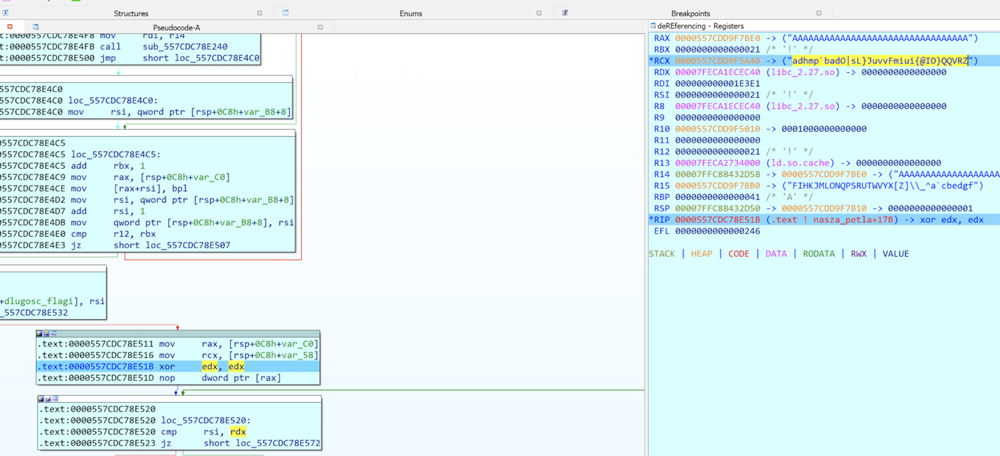

```py
from pwn import *

xor('adhmp`badO|sL}JuvvFmiui{@IO}QQVRZ', [x for x in range(7,0x28)])
```  


```sh
>>> xor('adhmp`badO|sL}JuvvFmiui{@IO}QQVRZ', [x for x in range(7,0x28)])
b'flag{look_ma_i_can_write_in_rust}'
```